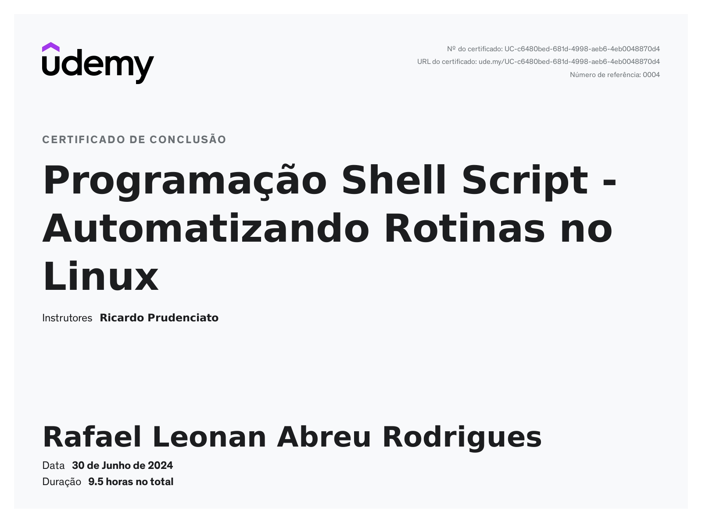

# Shell Script

## Descrição

Curso de Programação Shell Script para automatizar rotinas Linux.

## Curso

**Programação Shell Script - Automatizando Rotinas no Linux**

[Link para o curso na Udemy](https://www.udemy.com/course/programacao-shell-script/)

## Conteúdo do curso

- Gerar relatórios de usuários
- Gerar relatórios de funcionamento do Ambiente
- Monitorar a execução de processos, podendo inclusive mandar e-mails de alarme
- Monitorar recursos do sistema como Uso de CPU, Memória, Espaço em Disco e etc
- Gerar backups programados
- Enfim, criar vários tipos de ferramentas que facilitem o trabalho diário

## Certificado

